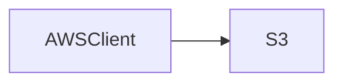
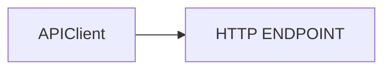

## Client

---

### These components are responsible for connecting to external services.

Ex.

```mermaid
graph LR
    A[AWSClient] --> B[S3]
```

```mermaid
graph LR
    A[APIClient] --> B[HTTP ENDPOINT]
```